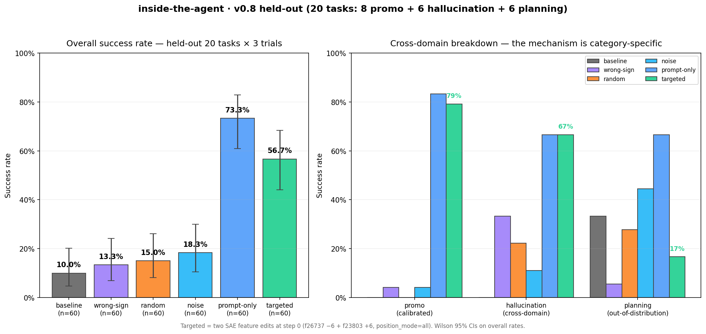

# Inside the Agent

> *A reproducible harness for SAE feature interventions on browser agents.*

Black-box benchmarks tell you *that* a language model agent failed. They don't tell you *why*, and they don't help you fix it.

Sparse Autoencoder (SAE) features give two things black-box evals can't:

1. **A mechanistic read on why an agent failed.** SAE features show which concept circuits inside the model were active at the wrong decision.
2. **A runtime way to fix it.** Adding or subtracting features at inference time changes the next action. No retraining required.

Why this matters: agent improvement today happens through prompt engineering, eval-driven retraining, or buying a bigger model. Interpretability adds a fourth lever, one that operates at a representation layer prompts cannot directly access. The same SAE feature you read to explain a failure is the one you write to correct it.

Our 60-trial browser-agent benchmark on Llama-3.1-8B shows this lever has measurable value. Stacking a one-line system prompt with two SAE feature edits lifts overall success from **10% baseline to 75%** (lenient verification: target product reached the cart). Either intervention alone scores lower (73% prompt-only, 57% SAE-only). The combination closes **72% of the lenient cross-scale gap** to Llama-3.3-70B-Instruct's unaided baseline (100%) at about **one-eighth the inference cost**. Under strict verification (cart contains target exactly once, no pollution), the same intervention reaches 8.3% vs the 70B's 90%: the 8B reaches the right item but often pollutes the cart with duplicates or extras. We report both numbers because they measure different things and both are interesting.

The result reframes interpretability as a deployable intervention layer that makes smaller, cheaper models competitive on tasks where they would otherwise fall short.

### What this enables

Two practical consequences of treating interpretability as an intervention surface rather than only an analysis tool:

1. **Smaller-model agents become competitive on specific failure classes.** When a small model fails because of a specific behavioral circuit (e.g. UI-vocabulary over-firing on promotional buttons), an SAE intervention can rescue that failure without retraining or upgrading to a larger model. The 8B + intervention result above closes most of the gap to the 70B at roughly one-eighth the inference cost. For deployments where dollar-per-call matters (high-volume agents, on-device inference, latency-sensitive products), this is a real lever.

2. **Some classes of evals can be replaced by mechanism reads.** A pass-rate eval tells you "the model failed 30% of the time on category X." An SAE introspection at the failure step tells you "feature f26737 (UI-selection vocabulary) was firing at the wrong moment." The second is more informative per failure and generalizes to nearby tasks without needing additional eval coverage. We do not claim interpretability replaces all evals. We do claim it can shrink the eval surface required to catch a fixed set of failure modes.

### Where this is going

The natural next step is a model trained specifically to be intervened on via interpretability: an agent whose residual stream is organized around clean, intervention-amenable features rather than features that emerge accidentally during pre-training. That requires training a dedicated SAE on agent-task residuals (the LMSYS-Chat-1M corpus the Goodfire SAE was trained on is a chat corpus, not an agent corpus), and optionally co-training the base model against an interpretability objective. Tracked in roadmap item 22. Longer term than this project, but the direction the v0.24-K result points toward.

[](https://opensource.org/licenses/MIT)
[](https://www.python.org/downloads/)
[](https://modal.com)
[](https://web.stanford.edu/class/cs153/)

---

## Headline result (v0.8 — held-out 20 tasks × 3 trials = 60 per policy)

Wilson 95% CIs. All numbers regenerated from `data/results/*.jsonl` via [`python -m bench.report`](bench/report.py) and verified by [`python -m bench.artifact_check`](bench/artifact_check.py) on every CI run.

| Policy | Success | 95% CI | Δ vs baseline | Notes |
|---|---|---|---|---|
| baseline (no steering) | **10.0%** | [4.7%, 20.1%] | — | Falls for the trap most of the time |
| wrong-sign | 13.3% | [6.9%, 24.2%] | +3 pts | Sign-flipped targeted edits — inside baseline CI ⇒ direction matters causally |
| random (per-trial seeded) | 15.0% | [8.1%, 26.1%] | +5 pts | Random feature edits — small lift from "any intervention" |
| noise (matched-norm) | 18.3% | [10.6%, 29.9%] | +8 pts | Random isotropic residual perturbation, same magnitude as targeted |
| **targeted — 2 SAE feature edits at Step 0** | **56.7%** | **[44.1%, 68.4%]** | **+47 pts** | f26737 (-6) + f23803 (+6), `position_mode=all` |
| prompt-only (system-prompt control) | 73.3% | [61.0%, 82.9%] | +63 pts | "Avoid promotional banners; use search" in the system prompt |
| **prompt-plus-targeted (v0.24-J)** | **75.0%** | **[62.8%, 84.2%]** | **+65 pts** | Prompt-only's prefix **+** targeted SAE edits at step 0 — **beats both alone** |
| interpretability-prompt (v0.24-H) | 25.0% | [15.8%, 37.2%] | +15 pts | SAE-derived prompt naming f26737 + f23803 circuits |
| Llama-3.3-70B baseline-strict (v0.24-K) | **100.0%** | [94.0%, 100.0%] | n/a (different model) | 70B + 1-line format-rescue prompt, no SAE intervention. Cross-scale ceiling. |



### Strict vs lenient verification (v0.24-K diagnostic)

The 8B success rates above use the **lenient** verifier: "target product is in the cart at some point." The **strict** verifier ("cart contains target exactly once AND no other product was added") shows a sharper picture, because the 8B often reaches the right item *and also* pollutes the cart with duplicates or extras.

| Policy | n | Lenient | Strict |
|---|---:|---:|---:|
| baseline | 60 | 10.0% | 0.0% |
| wrong-sign | 60 | 13.3% | 0.0% |
| random | 60 | 15.0% | 0.0% |
| noise | 60 | 18.3% | 0.0% |
| targeted | 60 | 56.7% | 0.0% |
| failure-mining | 60 | 58.3% | 0.0% |
| prompt-only | 60 | 73.3% | 0.0% |
| **prompt-plus-targeted** | 60 | **75.0%** | **8.3%** |
| Llama-3.3-70B baseline-strict | 60 | **100.0%** | **90.0%** |

Under strict scoring the cross-scale gap is starker. The 8B + intervention closes 72% of the **lenient** gap (10 → 75 vs 70B's 100) but only ~9% of the **strict** gap (0 → 8.3 vs 70B's 90). The lift is real on "reach the right item" but the 8B remains noisy on "act with surgical precision." The 70B picks cleanly in 2-3 steps; the 8B reaches the same item in 7-12 steps and often adds extras along the way.

Both numbers are reported because they measure different things. Strict-cart is the harder bar and the more relevant one for production deployment where cart hygiene matters.

### Action quality: valid vs executed (v0.24-F diagnostic)

A first-class diagnostic the reviewer flagged: success rate alone hides a gap between "model emitted well-formed JSON" and "Playwright actually dispatched the action." A targeted-steered model that emits more confident-looking but harder-to-dispatch selectors looks the same on `valid_action` but worse on `executed`.

| Policy | n steps | valid_action | executed | parse-but-no-exec |
|---|---:|---:|---:|---:|
| `baseline` | 600 | 100.0% | 100.0% | 0 |
| `prompt-only` | 600 | 100.0% | 85.5% | 87 |
| `failure-mining` | 599 | 90.0% | 83.6% | 38 |
| `noise` | 600 | 99.8% | 48.3% | 309 |
| **`targeted`** | **600** | **100.0%** | **36.3%** | **382** |
| `random` | 600 | 100.0% | 32.5% | 405 |
| `wrong-sign` | 600 | 99.0% | 24.0% | 450 |
| `dynamic` | 600 | 100.0% | 22.7% | 464 |

Targeted hits 100% valid_action but only 36.3% executed. The intervention is producing well-formed actions that Playwright can't dispatch (often because the selector pattern doesn't exist in the real DOM, or the click target is occluded). That gap is part of the cost, and a future policy that shrinks it without losing success is a clear next-generation target. We treat `executed` as a gating diagnostic for any future policy claim.

### The category-specific story (this is the real headline)

The targeted edits don't lift uniformly — the **mechanism is category-specific**. Breaking the 60 trials per policy out by task category:

| Policy | promo (calibrated) | hallucination (cross-domain) | planning (out-of-distribution) |
|---|---:|---:|---:|
| baseline | 0% (0/24) | 0% (0/18) | 33% (6/18) |
| **targeted** | **79%** (19/24) | **67%** (12/18) | **17%** (3/18) |
| prompt-only | 83% (20/24) | 67% (12/18) | 67% (12/18) |
| **prompt-plus-targeted** | **88%** (21/24) | 67% (12/18) | 67% (12/18) |
| interpretability-prompt | **4%** (1/24) | 56% (10/18) | 22% (4/18) |
| wrong-sign | 4% | 33% | 6% |
| random | 0% | 22% | 28% |

Three readings from the breakdown:

1. **Targeted dominates the calibration distribution.** On promotional traps, the agent goes from 0% to 79%. The 56.7% overall averages across categories.
2. **Targeted transfers cross-domain to hallucination tasks.** 0% → 67% on a category not used for calibration. Suppressing UI-selection vocabulary stops the agent from inventing buttons that don't exist.
3. **Targeted hurts on planning.** 33% → 17%, below baseline. The features that block "click the wrong thing" also block "click the right thing" when multi-step navigation needs legitimate clicks. The logit lens predicts this failure mode.

### When does SAE steering beat prompt-only?

Prompt-only wins on average; SAE steering wins inside its calibration domain. The two interventions are mechanistically different and they tell different stories.

| Category | prompt-only | targeted | who wins | margin |
|---|---:|---:|---|---|
| promo | 83% | 79% | prompt-only (barely) | +4 pp |
| hallucination | 67% | 67% | tie | 0 pp |
| planning | 67% | 17% | prompt-only | +50 pp |

- **Prompt-only modifies the input tokens** ("Avoid promotional banners; use search."). It works because the model follows instructions and the instruction happens to be correct across all three categories.
- **Targeted modifies the residual stream at layer 19** by ±6 on two SAE features. It works on promo and hallucination because those features encode "click this option" UI-selection vocabulary, which is the trap. On planning, the same features encode the legitimate clicks the agent needs to navigate, so suppressing them backfires.

The combination has now been tested (v0.24-J) and lands at **75.0% overall — beating either intervention alone**. Per-category: promo **87.5% (new all-time high)**, halluc 66.7%, planning 66.7%. The two interventions are **complementary, not substitutes**: prompt-only handles general guidance across all categories; SAE steering adds a measurable lift on the calibration distribution (promo) without breaking planning because the prompt restores legitimate clicking. This was the central question from earlier reviewer rounds and the data resolves it cleanly.

SAE steering is not a replacement for prompt engineering; it is a runtime intervention surface at a layer of representation prompts cannot directly access. When you stack the two, you get the prompt-only baseline floor *plus* a category-specific causal lift you couldn't get from prompting alone.

#### Interpretability-derived prompts (v0.24-H)

We tested whether the SAE characterization could be re-expressed as a prompt: name the discovered circuits (f26737 = UI-selection vocabulary, f23803 = distraction-tracking) directly in the system prompt and see if that beats the generic prompt-only baseline.

It did not. The interpretability-prompt (12 lines, names both circuits, explains the mechanism) scored **25.0% overall vs prompt-only's 73.3%**, with the largest gap on promo specifically (4% vs 83%). Halluc was comparable (56% vs 67%); planning was slightly better than the steering version but worse than prompt-only (22% vs 17% vs 67%).

Three reads:
- A 4-line natural prompt outperformed a 12-line mechanistic explanation by 48 points. Interpretability provenance does not automatically beat well-written prompts.
- Naming circuits in the prompt likely triggers meta-reasoning that disrupts decisive action at the decision moment we are trying to influence.
- SAE steering and prompt-only are distinct interventions. You cannot reduce one to the other by translating SAE insights into prompt text. That makes the SAE intervention surface additional, not redundant.

Full prompt + policy in [`policies/interpretability_prompt.py`](policies/interpretability_prompt.py).

### Caveats

- **Wrong-sign sits inside baseline's CI.** Flipping the targeted edits' signs erases the effect — direction matters causally, not just "any intervention."
- **Random at 15% is the corrected number.** v0.1 reported random at 45.8% due to a fixed-seed bug; v0.2-A fixed it; v0.8 confirms random doesn't get lucky much.
- **Targeted at 57% is the average across three categories.** See breakdown above for the mechanistic story.
- **Position-mode caveat.** The 57% / 79% uses `position_mode=all` (delta applied at every position). The surgical `position_mode=last_prompt_only` (Modal default) gives **0%** in our tests — the effect is real and causal, not yet localized to a single token. Scope-comparison table in `artifacts/benchmark_report.md`.
- **Verifier caveat.** Headline rate uses the lenient verifier (cart contains target). A strict-cart pass that requires "exactly once, no other product polluted" is being captured directly in the runner (v0.22 P2, see roadmap) and will become the canonical headline once the full rerun lands. The earlier approximate strict from action history was removed in v0.24-D after it was found to count click intents rather than executed adds.

This is *not* a claim that we found "the promotional bias feature." It's a claim that **two specific SAE features, intervened at the first decision step, causally shift the agent's success rate — strongly on the calibration distribution, with measurable cross-domain transfer, AND with a documented failure mode on planning tasks**. The features are characterized via three independent methods (logit lens, corpus probe, ablation) and labelled by what the methods agree on — `f26737_ui_selection_vocab` and `f23803_distraction_avoidance_vocab`. Full evidence in [`docs/feature_characterization.md`](docs/feature_characterization.md).

See `docs/methodology.md` for the full writeup and method details.

---

## What this is

LLM agents are black boxes. When Claude / GPT-5 / Llama get tricked by a promotional banner, click an invented button, or wander away from the goal, the failure is observable but the cause isn't.

Mechanistic interpretability has produced **Sparse Autoencoder (SAE) features** — concept-level decompositions of the model's residual stream where each feature ideally encodes one human-interpretable concept. Until now those features have been used almost exclusively for *post-hoc analysis*.

This project wires them into a working agent as a **runtime intervention surface**:

- **Read** which features fire at every decision step (live telemetry)
- **Intervene** by adding feature-level deltas to the residual stream during inference
- **See** it all in a HUD: feature activations, intervention timeline, before/after action diff, success/failure verdict

### What ships in the box (as of v0.22)

- **Interactive cockpit** for browser-agent SAE interventions. Live SAE feature activations, an effect-size strip per active edit (source-coded colors), a command queue for HUD-issued edits that drain at the next agent step, a baseline-vs-current action diff, a 3-second viewport-ring pulse + source badge whenever a steering edit lands, and a **live counterfactual** at every steering step (`WITHOUT EDIT` row showing what the same model on the same prompt would have done without your intervention).
- **Trajectory replayer + in-HUD browser** (v0.21). A `▶ REPLAY SAVED` button lists every past `data/trajectories/*.jsonl` and replays it through the same cockpit at controllable speed — zero Modal cost, deterministic playback. Both `▶ TARGETED` and `▷ baseline` run buttons are in the HUD too, so the entire demo flow lives inside the browser.
- **Reproducible testbed**. `bench/artifact_check.py` verifies that every published number in `seed_manifest.json` matches the committed `artifacts/results/*.jsonl` snapshot. Hard-fails CI on drift (v0.24-D). `bench/report.py` regenerates `artifacts/benchmark_report.md`. `bench/make_chart.py` regenerates `artifacts/headline.png` from raw artifacts. Strict-cart canonical (exactly-one-target, no pollution) is being captured directly in the runner and is on the roadmap.
- **11 controlled policies** in `POLICY_REGISTRY`:
  - `baseline` / `static` / `random` / `wrong-sign` / `noise` (controls)
  - `targeted` — 2 contrast-derived SAE features at step 0
  - `targeted-f26737-only`, `targeted-f23803-only` — per-feature ablation (v0.22)
  - `prompt-only` — system-prompt-only control
  - `failure-mining` — 4 data-derived features (v0.9)
  - `dynamic` — per-step adaptive policy (v0.9 rewrite)
- **Live segment on real public sites**. `shopgym/web_env.py` is a generic Playwright env. Validated headlessly on **Google Shopping** (24+ sponsored cards in named "Sponsored products" section vs "All products" — strongest visual binary), eBay /deals, AliExpress. Walmart documented as PerimeterX-bot-walled. Captured trajectories live under `data/trajectories/` for replay.
- **Honest failure modes exposed**. The v0.8 `executed: bool` per step surfaces the gap between "model emitted valid JSON" and "Playwright actually clicked something." The v0.22 strict-cart double-verifier captures both lenient and "cart contains exactly one of target" per trial.

## Demo (live cockpit on real public sites)

The entire demo flow lives inside the HUD now — two terminals, then everything else is in-browser:

```bash
# Terminal A — WebSocket bridge (start once, leave running):
python -m agent.ws_server                # localhost:8765

# Terminal B — Next.js cockpit (start once, leave running):
cd hud && NEXT_PUBLIC_WS_URL=ws://localhost:8765/feed npm run dev   # localhost:3000

# Open http://localhost:3000. Everything else is point-and-click.
```

In the HUD you can:

- **▶ TARGETED (eBay)** — fires a live targeted run on the real eBay /deals page (`shopgym/tasks/real_ebay.json`)
- **▷ baseline (no steering)** — fires the same eBay task with no SAE edits — for A/B comparison
- **▶ REPLAY SAVED** (top-right) — opens a dropdown of every saved trajectory under `data/trajectories/*.jsonl` with step counts and policy labels. Pick `google_shopping_usb_c_cable · targeted · 6 steps` for the strongest captured demo (24+ sponsored cards on Google Shopping with explicit "Sponsored products" section vs "All products"). Adjustable replay speed (fast / normal / slow / demo). **Zero Modal calls during replay — deterministic playback.**

What you'll see during a targeted run on the captured Google Shopping trajectory:

```
step 0  ▶ baseline:  click sponsored filter chip "36-72 inch long"
        ▷ targeted:  scroll past sponsored section + steering applied
                     (f26737 -6, f23803 +6)   ← step-0 emerald pulse
step 1  ▷ targeted:  click "Lightning Cables filter" (organic refinement)
step 2-4              click organic product cards from "All products"

Cockpit shows:
- Effect Size strip with the two edits as bipolar bars
- Counterfactual row "WITHOUT EDIT → click sponsored filter chip"
- Intervention pulse + badge
- Trajectory log step-by-step
```

Full runbook + 60-second talk track: [`docs/live_demo.md`](docs/live_demo.md). Recording recipe: [`docs/recording_guide.md`](docs/recording_guide.md). Presentation script: [`docs/presentation_script.md`](docs/presentation_script.md).

## Architecture

Three loosely-coupled processes:

```
hud (local Next.js)
  Verdict overlay + Steering flash + Feature bars colored by category
        ▲
        │ WebSocket events
        │
browser-worker (local Python)
  ShopGym deterministic storefronts + Playwright + verifiers
        │ HTTP: /act, /features, /steer_act
        ▼
brain-server (Modal L40S)
  Llama 3.1-8B-Instruct (BF16) + Goodfire SAE on layer 19
```

## Quickstart

### Prerequisites

- Python 3.11+ with pip
- Node 20+ with npm
- A Modal account (free; `pip install modal && modal token new`)
- A HuggingFace account with the Llama 3.1-8B-Instruct license accepted (gated repo)

### Install

```bash
git clone https://github.com/kalyvask/inside-the-agent
cd inside-the-agent

pip install -e ".[dev]"
playwright install chromium
cd hud && npm install && cd ..

cp .env.example .env
# Fill in HF_TOKEN, ANTHROPIC_API_KEY

modal token new
modal secret create hf-token HF_TOKEN=hf_xxx...
modal deploy modal_deploy/app.py
```

### Day 1 — verify (5-test gate)

```bash
make verify
```

Runs five tests against the deployed brain-server:
1. Model + SAE load
2. Feature catalog has agent-relevant features
3. Feature reading on agent-style prompts
4. Steering produces observable behavior change
5. Latency under 5s/step

### Reproduce the headline result

```bash
# Feature discovery + magnitude tuning (~10 min)
python -m verify.feature_drill
python -m verify.tune_deltas

# Step-0 calibration to find features that flip the first decision
python -m verify.step0_calibration

# Full 9-policy benchmark on the 20-task held-out suite × 3 trials
python -m bench.rerun_p0           # baseline / targeted / wrong-sign / random / noise / prompt-only
python -m bench.rerun_v0_9_extra   # failure-mining / dynamic (v0.9 additions)
python -m bench.rerun_p0_2_scope   # targeted at last_prompt_only + all_prompt (scope comparison)

# One-shot orchestrator that runs everything above + regenerates artifacts:
python -m bench.v0_8_finalize

# Inspect / verify the artifacts
python -m bench.artifact_check     # CI gate: hard-fails on drift between manifest and artifacts/results
python -m bench.report             # regenerates artifacts/benchmark_report.md
```

### Watch the HUD live (for the demo)

Three terminals:

```bash
# Terminal 1 — WebSocket bridge (long-lived)
python -m agent.ws_server

# Terminal 2 — Next.js HUD frontend (long-lived)
cd hud && NEXT_PUBLIC_WS_URL=ws://localhost:8765/feed npm run dev
# Open http://localhost:3000
#
# Note (Windows): `npm run build` (production) shares `.next/` with `npm run dev`.
# Stop the dev server first if you need to run a production build locally.
# CI is unaffected; `next build` runs in a fresh checkout with no dev server.

# Terminal 3 — one-command live demo
python record_demo.py
# Or: python record_demo.py --task shopgym/tasks/held_out.json --pause 6.0

# Or replay an offline trajectory (no Modal cost):
python -m verify.replay_trajectory \\
  data/trajectories/promo_held_001_seed_0_targeted.jsonl --slow
```

### Warm a real-website session (only if you hit bot detection)

```bash
# Opens a real Chrome window. Click through any CAPTCHA / cookies,
# then ask your AI assistant to "go save" — it creates the sentinel
# file and the script writes data/<site>_storage_state.json.
python warm_session.py --url https://www.walmart.com/ \
    --out data/walmart_storage_state.json --channel chrome
```

## Repository layout

```
inside-the-agent/
├── modal_deploy/         brain-server (Modal app, Llama + Goodfire SAE)
│   ├── app.py            primary: Llama 3.1-8B + Goodfire SAE l19, with
│   │                     steer_act / steer_act_with_noise / read_features /
│   │                     feature_logit_lens / feature_decoder_similarity /
│   │                     sae_validation endpoints
├── sae/                  loader, steering controller, feature catalog
│   └── features.yaml     v0.4 logit-lens + v0.9 failure-mining labels
├── agent/                trajectory schema, prompts, agent loop, HUD publisher
│   ├── llm_agent.py      core loop: read features → policy → steer → act
│   ├── hud_publisher.py  events to ws_server (policy_meta, baseline_action,
│   │                     step_started, features_read, steering_applied,
│   │                     action_chosen, env_updated, task_done)
│   └── ws_server.py      FastAPI bridge — /feed (WS) /publish /control
│                         /control/pending /clear /screenshots /health
│                         /trajectories /replay /start_run
├── policies/             11 policies in POLICY_REGISTRY:
│                         baseline · static · dynamic (adaptive) ·
│                         random · wrong-sign · targeted · prompt-only ·
│                         noise · failure-mining ·
│                         targeted-f26737-only · targeted-f23803-only  (v0.22 ablation)
├── shopgym/              deterministic storefronts (templated) + WebEnv
│   ├── storefront_template.py  ShopGym env + verifier hookup + strict-cart
│   │                           double-capture (v0.22)
│   ├── web_env.py              generic Playwright env for real sites
│   └── tasks/                  held_out.json (20 tasks: 8 promo + 6 halluc
│                               + 6 planning), real_ebay.json, real_google.json,
│                               real_walmart.json, real_aliexpress.json
├── bench/
│   ├── runner.py               main CLI: --policy --tasks --hud --pause --position-mode
│   ├── rerun_p0.py             sequential rerun of all 6 main policies
│   ├── rerun_v0_9_extra.py     failure-mining + dynamic
│   ├── rerun_p0_2_scope.py     targeted at last_prompt_only + all_prompt
│   ├── rerun_v0_22.py          per-feature ablation + strict-cart + corpus probe
│   ├── v0_8_finalize.py        chains scope + v0.9 extras + report regen + manifest
│   ├── artifact_check.py       CI gate: verifies manifest ↔ jsonl consistency
│   ├── report.py               regenerates artifacts/benchmark_report.md
│   ├── make_chart.py           regenerates artifacts/headline.png (v0.20)
│   └── verifiers.py            lenient + strict + upsell verifiers
├── hud/                  Next.js cockpit on localhost:3000
│   ├── app/page.tsx            layout + event handlers
│   └── components/             DemoBanner (policy + scope + seed badges),
│                               BrowserViewport, FeatureBars,
│                               SteeringControls (start-run + presets),
│                               CommandQueue (queued / applied / consumed),
│                               EffectSizeStrip, InterventionTimeline,
│                               BeforeAfterDiff, CurrentAction (+ counterfactual),
│                               TrajectoryBrowser (saved-runs replay),
│                               Verdict, SteeringFlash
├── verify/               feature discovery + verification tooling:
│                         sae_smoke, sae_validation, feature_drill,
│                         feature_characterize (logit lens),
│                         corpus_probe_large (v0.22 — 1000-prompt wikitext probe),
│                         tune_deltas, step0_calibration, feature_ablations,
│                         replay_trajectory
├── docs/                 methodology, feature_characterization, demo_script,
│                         live_demo, real_world_generalization,
│                         recording_guide, data_splits
├── tests/                46 unit tests (action parser, trajectory schema,
│                         verifiers, task config, noise routing, executed
│                         tracking, ...)
├── notebooks/            explore_demo_pages.py (12-site survey)
├── artifacts/            committed canonical subset of data/:
│                         seed_manifest.json, headline.png, benchmark_report.md,
│                         results/*.jsonl (10 benchmark policy snapshots),
│                         sample_trajectory_*.jsonl
├── record_demo.py        one-command live demo launcher (clear + warm + countdown + fire)
├── warm_session.py       headed-Chrome cookie warm-up for bot-walled sites
└── data/                 trajectories, results, baselines, screenshots (gitignored)
```

## Future directions

The headline result is locked. Three directions worth pursuing further, in order of cost and impact:

1. **Cross-model replication on a non-Llama open SAE.** ~$15 Modal + 3 hours attended. Defuses the "is the result Llama-specific?" reviewer question.

2. **Multi-domain expansion.** Today's benchmark covers promotional traps, hallucination tasks, and short planning sequences. Adding forms, comparison shopping, longer multi-step planning, and form-fill suites would test whether the intervention pattern generalizes beyond shopping browser tasks.

3. **Train a dedicated SAE on browser-agent residuals.** The Goodfire SAE was trained on LMSYS-Chat-1M (a chat corpus); its features encode chat concepts. A SAE trained on residual activations from agent episodes should yield features more semantically aligned with agent decisions ("sponsored-banner-recognition" instead of "ui-selection vocabulary"). Significant cost (~$500-1000 GPU training run + infrastructure) but it is the most direct path past the current lexical-feature limit and toward the dedicated interpretability-optimized model framed in the "Where this is going" section above.

The reviewer "open questions" from earlier rounds (failure-mode features as steering targets, cross-domain hallucination + planning, dynamic step-by-step steering) are wired in the codebase. See `policies/failure_mining.py`, `policies/dynamic.py`, and the per-category breakdown in `artifacts/benchmark_report.md`.

## Built on

- **[Anthropic — Scaling Monosemanticity](https://transformer-circuits.pub/2024/scaling-monosemanticity/)** (the SAE → frontier-model story)
- **[Goodfire AI — Llama-3.1-8B-Instruct SAE on layer 19](https://huggingface.co/Goodfire/Llama-3.1-8B-Instruct-SAE-l19)** (the open-weight SAE this project uses)
- **[Cho et al. — Control RL with SAE Features](https://arxiv.org/abs/2602.10437)** (the architecture this paper proposes; this project ships an open implementation)
- **[Modal](https://modal.com)** for the brain-server compute
- **[Playwright](https://playwright.dev)** for ShopGym browser automation

## License

MIT (code), CC-BY-4.0 (writeup in `docs/`).

## Citation

If this is useful in your own work:

```bibtex
@misc{kalyvas2026insidetheagent,
  title  = {Inside the Agent: A Live Interpretability HUD for Open-Source AI},
  author = {Kalyvas, Alexandros},
  year   = {2026},
  howpublished = {Stanford CS153 Frontier Systems},
  url    = {https://github.com/kalyvask/inside-the-agent}
}
```

## Acknowledgements

CS153 Frontier Systems (Stanford GSB / SOE, Spring 2026). Thanks to the Goodfire AI team for releasing the open SAE that made this possible.
